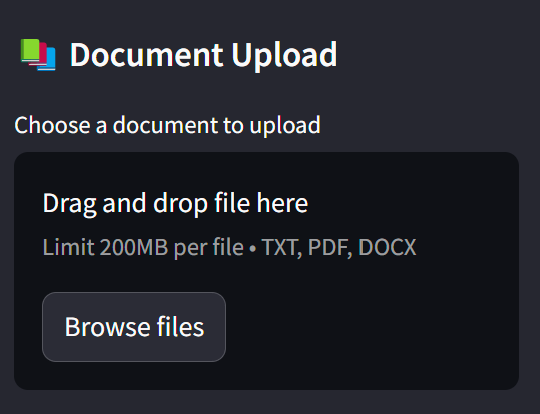

# AI-Chatbot

## Overview
AI-Chatbot is a smart question-and-answer application that provides intelligent answers based on personal documents. Utilizing advanced natural language processing techniques, this application allows users to upload documents and interact with them through a conversational interface.

## Features
- **Document Upload**: Users can upload various document types (PDF, TXT, DOCX) for processing.
- **Intelligent Q&A**: The chatbot can answer questions based on the content of the uploaded documents.
- **Chat History**: Users can view their past interactions and continue previous sessions.
- **User-Friendly Interface**: Built with Streamlit, the application features a clean and attractive UI.
- **Session Management**: Each user session is uniquely identified, allowing for personalized interactions.

## Technologies Used
- **Backend**: FastAPI for building the API.
- **Frontend**: Streamlit for creating the user interface.
- **Document Processing**: Langchain for handling document embeddings and similarity searches.
- **Storage**: FAISS for efficient similarity search and indexing of document content.
- **Deployment**: Uvicorn for serving the FastAPI application.

## Installation

### Prerequisites
- Python 3.8 or higher
- pip (Python package installer)

### Steps
1. Clone the repository:
   ```bash
   git clone https://github.com/yourusername/AI-Chatbot.git
   cd AI-Chatbot
   ```

2. Create a virtual environment (optional but recommended):
   ```bash
   python -m venv venv
   source venv/bin/activate  # On Windows use `venv\Scripts\activate`
   ```

3. Install the required packages:
   ```bash
   pip install -r requirements.txt
   ```

4. Set up environment variables:
   - Create a `.env` file in the root directory and add your Google API key:
     ```
     GOOGLE_API_KEY=your_api_key_here
     ```

## Usage

### Running the Application
1. Start the FastAPI backend:
   ```bash
   uvicorn src.main:app --reload
   ```

2. Start the Streamlit frontend:
   ```bash
   streamlit run app.py
   ```

3. Open your web browser and navigate to `http://localhost:8501` to access the application.

4. Test the API
   Use the Swagger UI at `http://localhost:8000/docs` to test the API endpoints.

### Interacting with the Chatbot
- Upload a document using the provided interface.
- Ask questions related to the content of the uploaded document.
- View chat history and continue previous sessions.

## UI Screenshots
Here are some screenshots of the user interface:

### Home Screen


### Document Upload


### Chat Interface


### Chat History


## API Endpoints
- `GET /`: Returns a simple greeting message.
- `POST /upload_doc`: Uploads a document for processing.
- `GET /get_indexes`: Retrieves all available document indexes.
- `POST /qa`: Submits a question and retrieves an answer based on the uploaded documents.
- `GET /get_convs`: Retrieves conversation history for a specific session.

## Contributing
Contributions are welcome! If you have suggestions for improvements or new features, please open an issue or submit a pull request.

## License
This project is licensed under the MIT License. See the [LICENSE](LICENSE) file for details.

## Acknowledgments
- Thanks to the contributors of the libraries used in this project, including FastAPI, Streamlit, Langchain, and FAISS.
- Special thanks to the open-source community for their invaluable resources and support.

## Contact
For any inquiries or feedback, please reach out to [ameympatil@gmail.com].